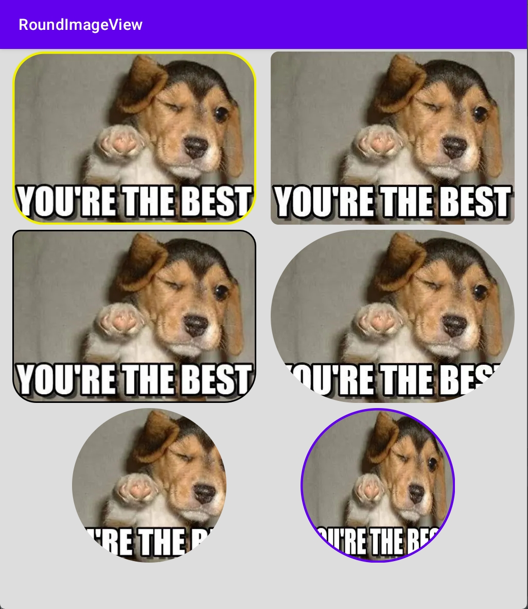

# RoundImageView
Android圆角图片解决方案

[](https://www.jitpack.io/#voisen/RoundImageView)


# 示例

> 支持指定圆角，圆角半径以及边框线等




# 特点

- 支持图片填充模式：`fitxy` `centerCrop` 两种
- 支持指定圆角： `左上` `右上` `右下` `左下`
- 支持设置全部圆角的值，优先级: `radius` < `指定圆角`
- 支持设置边框宽度与颜色
- ...

# 使用方法

1. 添加maven仓库

````groovy

	dependencyResolutionManagement {
		repositoriesMode.set(RepositoriesMode.FAIL_ON_PROJECT_REPOS)
		repositories {
			mavenCentral()
			maven { url 'https://www.jitpack.io' }
		}
	}

````


2. 添加依赖项

````groovy

	dependencies {
	        implementation 'com.github.voisen:RoundImageView:Tag'
	}

````

3. 代码示例

````xml

        <com.github.voisen.RoundImageView
                android:layout_margin="3dp"
                android:radius="40dp"
                app:border_width="3dp"
                app:border_color="#f0f000"
                android:layout_width="wrap_content"
                android:layout_height="wrap_content"
                android:src="@drawable/test1" />

        <com.github.voisen.RoundImageView
            android:layout_margin="3dp"
            android:radius="10dp"
            android:layout_width="wrap_content"
            android:layout_height="wrap_content"
            android:src="@drawable/test1" />

        <com.github.voisen.RoundImageView
            android:layout_margin="3dp"
            android:topLeftRadius="10dp"
            android:topRightRadius="20dp"
            android:bottomLeftRadius="30dp"
            android:bottomRightRadius="40dp"
            app:border_color="@color/black"
            app:border_width="2dp"
            android:layout_width="wrap_content"
            android:layout_height="wrap_content"
            android:src="@drawable/test1" />

        <com.github.voisen.RoundImageView
            android:layout_margin="3dp"
            android:radius="500dp"
            android:layout_width="wrap_content"
            android:layout_height="wrap_content"
            android:src="@drawable/test1" />

        <com.github.voisen.RoundImageView
            android:layout_margin="3dp"
            android:radius="500dp"
            android:layout_width="100dp"
            android:layout_height="100dp"
            android:src="@drawable/test1" />

        <com.github.voisen.RoundImageView
            android:layout_margin="3dp"
            app:scaleMode="fitXY"
            app:border_width="3dp"
            app:border_color="@color/purple_500"
            android:radius="500dp"
            android:layout_width="100dp"
            android:layout_height="100dp"
            android:src="@drawable/test1" />

````


